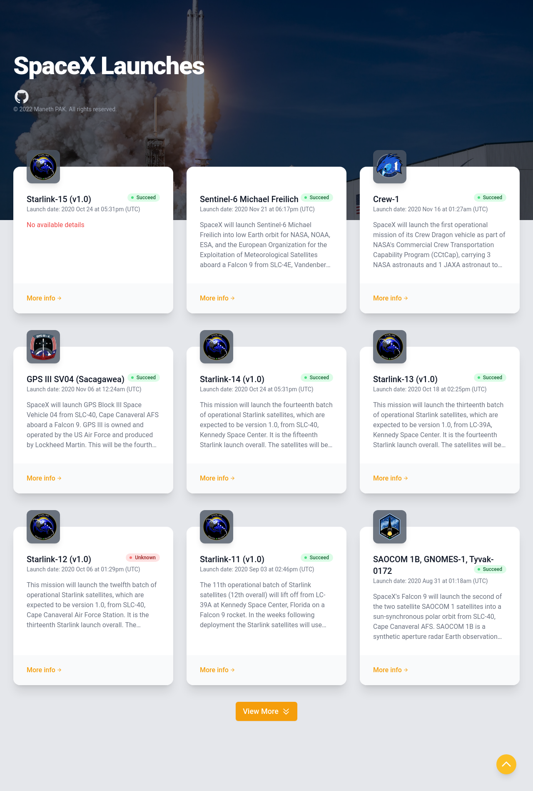

# React - GraphQL (Apollo Client) - SpaceX API

## About this Project

This project was created with the aim to learn how GraphQL works and how it can be integrated with a react project. Since I have no prior experience working with Graphql, I decided to start this project with inspiration from Fireship's [GraphQL Basics - Build an app with the SpaceX API](https://www.youtube.com/watch?v=7wzR4Ig5pTI&t=788s) and Colby Fayock's [Next.js GraphQL Tutorial - Launch Dashboard with SpaceX GraphQL API & Apollo Client](https://www.youtube.com/watch?v=oxUPXhZ1t9I&t=135s).

Check live preview [here](https://manethpak.me/react-gql-spacex/).

### Techstack

- [TypeScript](https://www.typescriptlang.org/)
- [React](https://reactjs.org/)
- [TailwindCSS](https://tailwindcss.com/)
- [Apollo GraphQL](https://www.apollographql.com/)
- [GraphQL Code Generator](https://www.graphql-code-generator.com/) with `React-Apollo Hooks` schema

## Mission

My mission for this project is to build a React app that will render a list of past launches by SpaceX and its respective details. Data was provided by [SpaceX GraphQL API](https://medium.com/open-graphql/launching-spacex-graphql-api-b3d7029086e0). I also use GraphQL Code Generator to generate schema and hooks which is used to provide data to each page.

## Preview

### Homepage

### Detail page

## Outcome

After completing this project I was able to get a glimpes of what GraphQL is and how capable it is when use correctly with the right tools. I get to learn on how to write GraphQL query using Variables, Arguments and Fragments as well as its type system. GraphQL Code Generator made everything about GraphQL so easy to use with its generator that generated custom API hooks using React Query.

Beside the GraphQL stuff, I was also get to know React Query which was built into Apollo Client and is mainly use for making API request. I had never tried React Query before and to my surpires it was super easy to use and maintain data state!

Overall building this project was a really fun experience, I get to learn and challenge myself with something new once in a while.🥰
